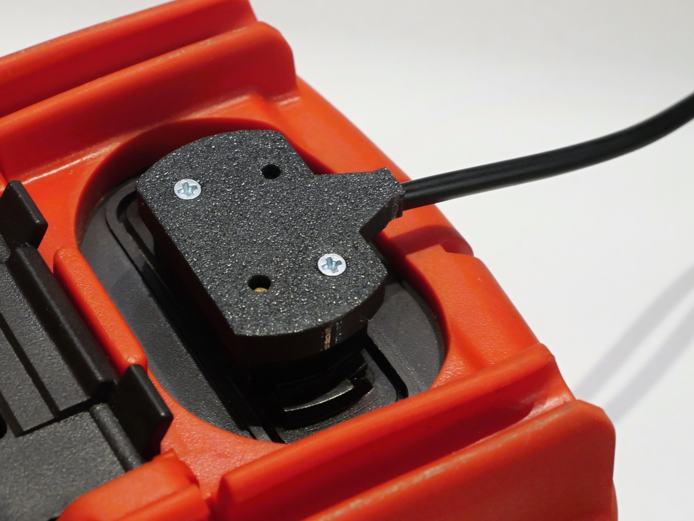
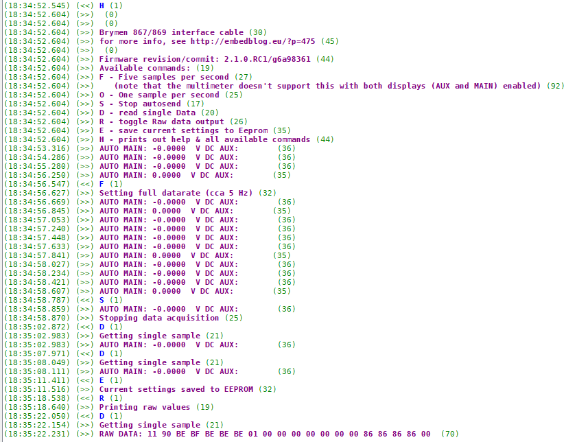
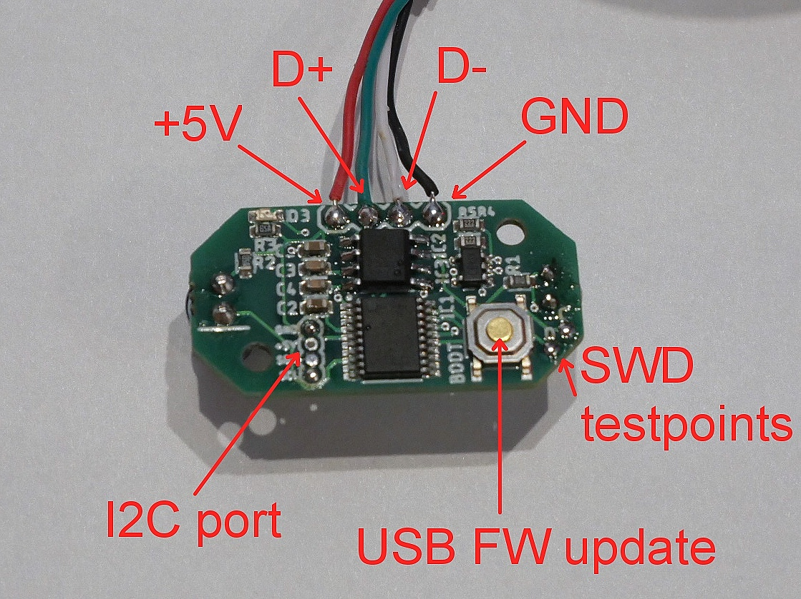
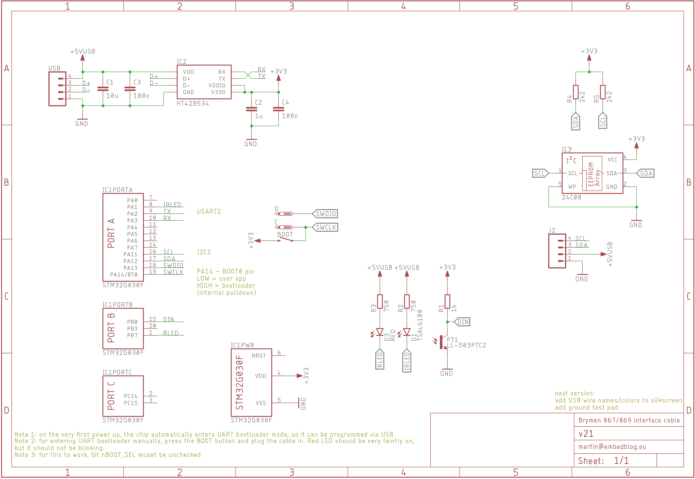

# Brymen 867/869 adapter cable rev2.1
*see the article [here](http://embedblog.eu/?p=830) or the listing [here](https://www.tindie.com/products/martind/brymen-867869-adapter-cable/)*

## Features
- reads data from Brymen 867/869 via infrared
- sends the measurements at 115200 baud via serial port
- output data rate and format adjustable (5 readings/s, 1 reading/s, single reading); settings are stored in EEPROM and remembered on next power up
- BOOT0 pin available as a button, so you can update the FW without disassembling the case
- activity LED

*Here's how the serial output looks:*

*If you are ordering it without the USB cable, here's how to connect it:*

*Note: revisions 1.x can be found [here](https://github.com/MartinD-CZ/brymen-867-interface-cable/blob/master/README.md), revision 2.0 can be found [here](https://github.com/MartinD-CZ/brymen-867-869-interface-cable-rev20).*

*And here's the schematic:*
